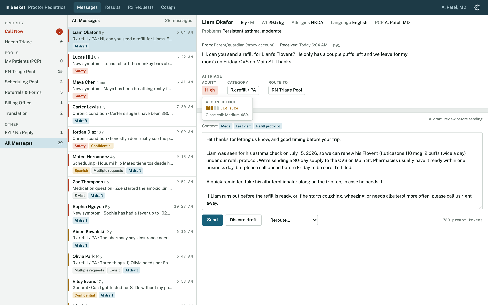
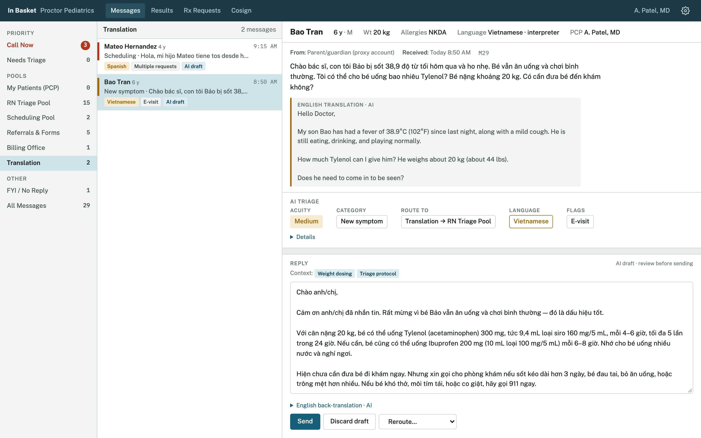
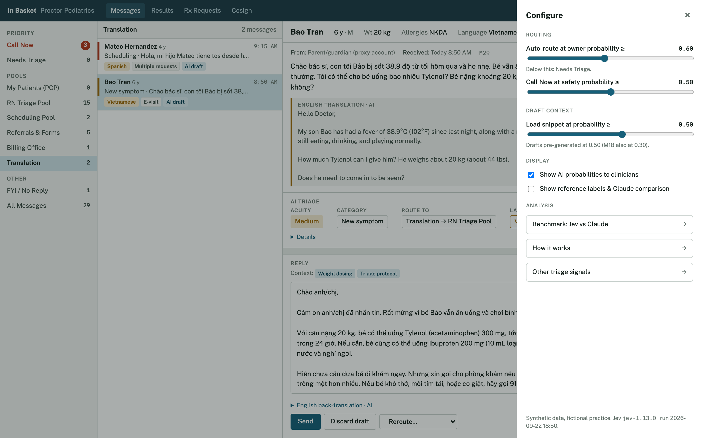
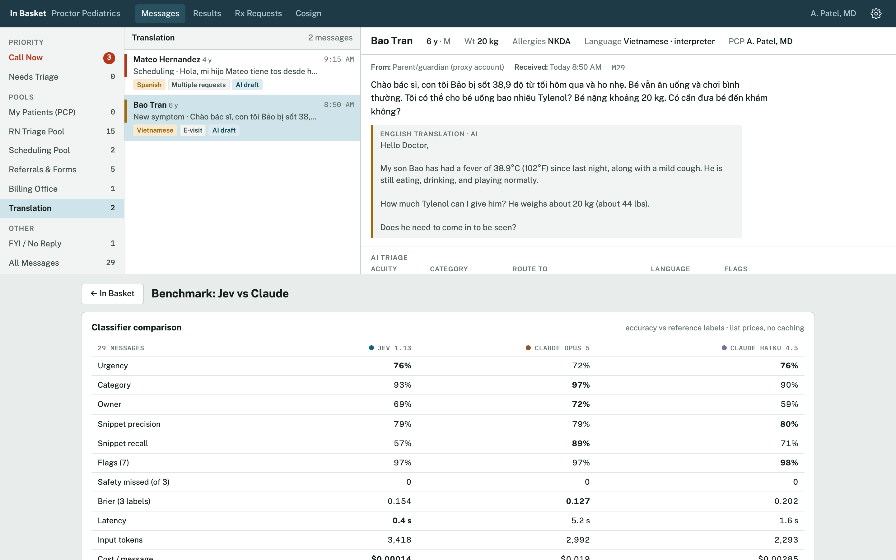

# In-Basket Triage

**Drafting replies is only half of the in-basket problem. Can a small, non-generative model do the other half, the sorting?**

This is a working mock-up of that idea, built on [Jev](https://docs.typesafe.ai) from TypeSafe AI. Each patient-portal
message is read once by Jev, which answers 26 questions in a single request:

- **Urgency:** high, medium or low
- **Category:** refill, new symptom, forms, billing and 7 others
- **Owner:** RN triage pool, PCP, scheduling, referrals & forms, or billing
- **Which of 16 prompt snippets** the reply drafter needs (meds, labs, refill protocol, triage protocol, teen confidentiality and so on)
- **7 flags:** safety, multiple requests, confidential teen care, frustrated sender, non-English, e-visit candidate, needs a reply

Plain code turns those probabilities into routing. An LLM (Claude Opus 5) then drafts the reply using **only the
snippets Jev picked**. The viewer is a clinician's in-basket, so what you see is what the RN, PCP or scheduler would see.

**Live demo:** https://stephonomon.github.io/inbasket-triage/ (a self-contained page with the results embedded; the browser makes no API calls)

**Video walkthrough:** https://youtu.be/hMhzvX1LeGw

[](https://youtu.be/hMhzvX1LeGw)

▶ [Watch Stephon walk through the demo on YouTube](https://youtu.be/hMhzvX1LeGw)

> Everything here is fabricated. There are no real patients, messages, or clinicians, and Proctor Pediatrics is fictional.
> The reference labels are one informaticist's judgment, not clinician-adjudicated. Nothing in this repository is
> medical advice or a validated clinical tool.

---

## Why

Most in-basket AI work focuses on drafting the reply. But before anyone drafts anything, somebody has to decide:

1. **How urgent is this?** A four-month-old with blue lips should not sit in a queue behind a sports form.
2. **Whose is it?** A refill that falls under the nursing protocol, a stimulant refill that needs the PCP, a bill, a
   records request, and a surgery-clearance letter each belong to a different person.
3. **What does the drafter need to know?** EHR drafting has moved from one monolithic prompt to many small context
   snippets. Loading all of them for every message is expensive and noisy; loading the wrong ones gives a confident,
   wrong draft.

You can ask a large language model all of this. It works, but it's slow and costs about as much per message as the
draft does, and its "confidence" is a number it wrote down. Jev does **no text generation**. You give it the
message (the *state*) and typed questions (*Choice* or yes/no *Noul*), and it returns a probability for every
option. The thresholds live in code, where a practice can set and test them.

## What the demo shows

**The clinician view.**
- **Folders:** Call Now, Needs Triage, one folder per pool, Translation, and FYI / No Reply.
- **Message list:** sorted by acuity, with a colored priority bar and tags such as Safety, Confidential, Vietnamese or AI draft.
- **Message pane:** a patient banner, then AI triage fields (Acuity, Category, Route to, Language). Hover over any field to see the model's confidence and, when the runner-up was close, the close call.
- **Draft:** editable, with the context snippets it used shown as chips.



**Routing rules (code, not model):**

| Condition | Where it goes | Draft? |
|---|---|---|
| Safety probability ≥ 0.50 | **Call Now**: the phone-triage RN calls the family | No |
| Language is not English | **Translation**, then the owner pool | Yes, in the sender's language, with an English back-translation |
| Needs-reply probability < 0.50 | **FYI / No Reply** (thank-you notes) | No |
| Owner probability < 0.60 | **Needs Triage**: a person picks the pool | Yes, once routed |
| Otherwise | The owner pool Jev chose | Yes |

**Response clocks (code, not model):** every message that needs a reply gets a respond-by time, started from the
urgency probabilities rather than the urgency label. See [Response clocks](#response-clocks) below.

**Behind the gear** (the configure panel):
- **Sliders:** the auto-route, Call Now, response-clock and snippet-loading thresholds.
- **Sort by response clock:** order the list by respond-by time instead of acuity.
- **Display toggles:** turn the confidence cards off for clinicians, or overlay the reference labels and the Claude comparison.
- **Analysis views:** a benchmark, a pipeline diagram and other triage ideas.



## Results

29 messages. Jev 1.13 against Claude Opus 5 (effort low) and Claude Haiku 4.5. The Claude models got the same
label definitions, used structured output, and reported a confidence for each label. Accuracy is agreement with my
reference labels. Costs are at list price with no prompt caching.

| | Jev 1.13 | Claude Opus 5 | Claude Haiku 4.5 |
|---|---:|---:|---:|
| Urgency | 76% | 72% | 76% |
| Category | 93% | 97% | 90% |
| Owner / pool | 69% | 72% | 59% |
| Snippet precision / recall | 79% / 57% | 79% / 89% | 80% / 71% |
| 7 flags | 97% | 97% | 98% |
| Safety messages missed (of 3) | 0 | 0 | 0 |
| Brier score, 3 labels (lower is better) | 0.154 | 0.127 | 0.202 |
| Mean latency | 0.4 s | 5.2 s | 1.6 s |
| Cost per message | **$0.00014** | $0.019 | $0.0029 |



What I take from it:

- **Same accuracy range, about 140× cheaper and 13× faster.** On urgency, category and owner, Jev is within a few
  points of Opus 5. All three models caught all three safety messages.
- **The draft is where the money is, and the snippets are how you save it.** 25 of 29 messages got a draft. Loading
  only Jev's snippets cut the draft prompt from 1,827 to 645 tokens on average. Per 100,000 messages, Opus triage plus
  a draft with every snippet loaded comes to about **$3,300**. Jev triage plus a draft with Jev's snippets comes to
  about **$890**.
- **Snippet recall is Jev's weak spot at 0.5.** It loads fewer snippets than Opus does (57% recall vs 89%). Lowering
  the threshold to 0.3 raises recall to 72% at 66% precision. This matters in practice. When a teenager asked about
  confidential STI testing, the insurance snippet scored 0.37 and was left out, so the draft wrongly said her parents
  might get an insurance statement. With the threshold at 0.3 it loads the snippet, and the draft correctly offers the
  practice's confidential-services billing. Both drafts are in the benchmark view.
- **Calibration was not a Jev win here.** Opus's self-reported confidence scored a slightly better Brier score.
- **Most owner "errors" are a policy question.** In most of the owner disagreements, all three models agreed with
  each other and against my reference. For example, should the RN pool or the PCP answer "is MMR safe when a sibling
  is on chemo?" That depends on the practice's nursing protocols. The fix is to write the local policy into the
  owner definition, which is a one-line change you can test on last month's messages.

Caveats: 29 synthetic messages and one person's reference labels. This is a demonstration, not a validation.

## Response clocks

The urgency definitions already carry time windows: high is within hours, today; medium is 1 business day; low is 2-3
business days. The clock uses those windows, but it chooses the level from the whole urgency distribution, not only the top
label.

Urgency is ordered, and the top label ignores that. M22 is a parent's third message about a surgery-clearance letter.
Jev scored it 0.39 low, 0.36 medium, 0.25 high. The label is Low, a 3-business-day clock, although medium-or-worse is
0.61 likely. The clock takes the more urgent of two readings:

1. the most urgent level the message is at least 0.50 likely to reach (the median of the three), and
2. the Acuity label.

The second reading is there because the median alone can loosen a clock: 0.40 high, 0.35 medium, 0.25 low has a median of
medium next to an Acuity label of High. So the clock can be tighter than the label but never looser. A slider lowers the
0.50 for a more cautious practice. Averaging the windows by probability is deliberately not offered: it would turn a 25%
chance of an emergency into a middling deadline.

| Clock rule, 25 clocked messages | Too loose | Too tight |
|---|---:|---:|
| Acuity label alone | 1 (M22) | 6 |
| **P(at least this urgent) ≥ 0.50** | **0** | **6** |
| ≥ 0.40 | 0 | 7 |
| ≥ 0.30 | 0 | 8 |

"Too loose" means the clock gives more time than the reference urgency allows. At 0.50 the clock removes the one too-loose
clock and adds no tight ones; the six tight clocks are messages where the Acuity label itself disagrees with the
reference. Call Now messages and messages that need no reply get no clock. Windows are 4 hours, 1 business day and
3 business days, set in `clock.py`. Business days skip weekends; there is no holiday calendar.

This is one message on 29, and 0.50 was chosen as the median, not tuned on this set. It shows the rule behaves as
intended; it does not show the rule is better in practice. M22 is also urgent for operational reasons, a deadline and a
repeat message, rather than clinical ones, which the urgency definitions mix together. A repeat-message signal is the
natural next step for cases like it.

## Beyond urgency, category and owner

The 7 flags were asked in the same request at no extra cost, and each one drives something in the UI:

- **Safety:** skip every queue, call the family, never draft.
- **No reply needed:** file thank-you notes without a task or an LLM call.
- **Multiple requests:** split a refill + school form + side-effect message into separate tasks.
- **Confidential teen care:** force the confidentiality snippet and lock the reply to the teen's account.
- **Frustrated sender:** service recovery ("this is the third message I've sent").
- **Language:** route to the Translation pool, draft in the sender's language, and show staff English translations.
- **E-visit candidate:** surface billable portal care before the reply goes out.

Ideas not built yet: merging repeat messages into one thread, and weekly drift and workload monitoring from the stored
probabilities.

## Run it yourself

```bash
pip install anthropic
export ANTHROPIC_API_KEY=...          # for the Claude baselines, drafts and translations
export TYPESAFE_API_KEY=...           # or put it in ~/.typesafe_api_key
python triage.py                      # Jev + Opus + Haiku triage and Opus drafts for every message -> results.json
python alt_draft.py                   # re-draft M18 with the snippet threshold at 0.3
python lang.py                        # Jev language question + English translations (also merges results_partial.json)
python score.py                       # console summary against the reference labels, including response clocks
python -m unittest                    # tests for clock.py (standard library only, no API keys)
python build.py                       # results.json + template.html -> index.html
```

`python triage.py M29` runs only the named messages and writes `results_partial.json`; `lang.py` merges it in.
A full run of 29 messages takes about 90 seconds and costs about $1, almost all of it Claude.

| File | What it is |
|---|---|
| `data.py` | Patients, messages, reference labels, the 16 snippets and practice-level snippet text |
| `triage.py` | The Jev request (26 questions), the Claude baselines, the routing policy, prompt assembly and drafting |
| `lang.py` | Jev language Choice; Claude translations of non-English messages and drafts |
| `alt_draft.py` | The M18 threshold comparison |
| `score.py` | Scoring against the reference labels |
| `clock.py` / `test_clock.py` | Response clocks from the urgency distribution, and their tests |
| `template.html` / `build.py` | The viewer; `index.html` is the built page |

## Credits

Built by Stephon Proctor with [Claude](https://claude.ai) (Anthropic), which wrote the code, the synthetic data and the
viewer. Jev is from [TypeSafe AI](https://typesafe.ai). A companion demo, [Scribe Verify](https://github.com/Stephonomon/scribe-verify),
uses Jev to check an ambient-scribe note against its transcript.

MIT License.
